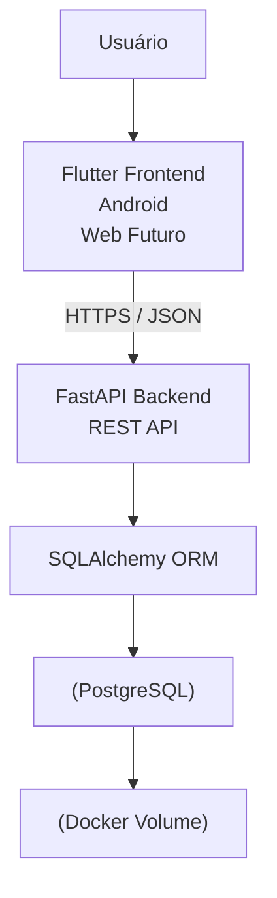
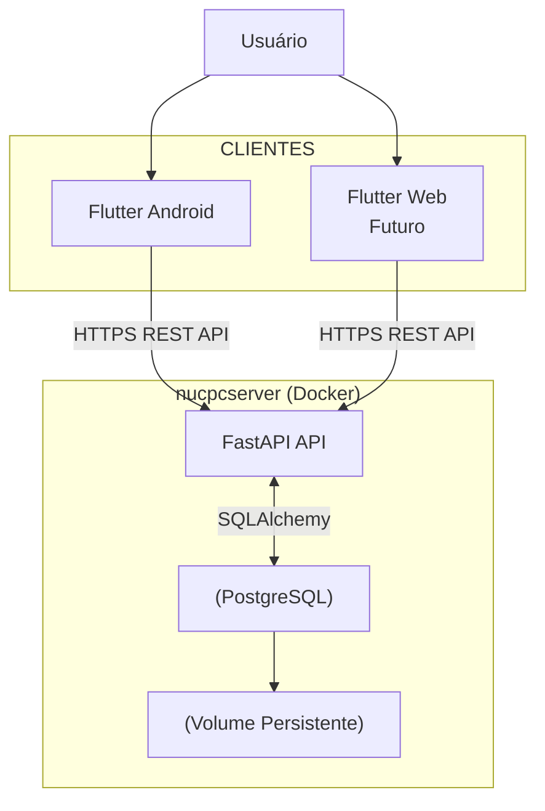
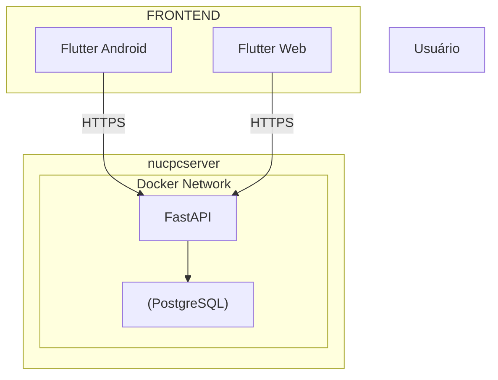

# Arquitetura (Visão de contexto)

```mermaid
flowchart TD

    U[Usuário]

    F["Flutter Frontend<br/>Android<br/>Web Futuro"]

    API["FastAPI Backend<br/>REST API"]

    ORM[SQLAlchemy ORM]

    DB["(PostgreSQL)"]

    VOL["(Docker Volume)"]

    U --> F

    F -->|HTTPS / JSON| API

    API --> ORM

    ORM --> DB

    DB --> VOL
```

# Arquitetura (Visão técnica)

```mermaid
flowchart TD

    USER[Usuário]

    subgraph CLIENTES
        ANDROID[Flutter Android]
        WEB["Flutter Web<br/>Futuro"]
    end

    subgraph NUCPCSERVER["nucpcserver (Docker)"]

        API[FastAPI API]

        DB["(PostgreSQL)"]

        STORAGE["(Volume Persistente)"]

        API <-->|SQLAlchemy| DB

        DB --> STORAGE

    end

    USER --> ANDROID
    USER --> WEB

    ANDROID -->|HTTPS REST API| API
    WEB -->|HTTPS REST API| API
```

# Arquitetura (Comunicação Frontend/Backend)

```mermaid
flowchart TD

    USER[Usuário]

    subgraph FRONTEND
        APP[Flutter Android]
        WEB[Flutter Web]
    end

    subgraph NUCPCSERVER["nucpcserver"]

        subgraph DOCKER["Docker Network"]

            API[FastAPI]

            DB["(PostgreSQL)"]

            API --> DB

        end

    end

    APP -->|HTTPS| API
    WEB -->|HTTPS| API
```